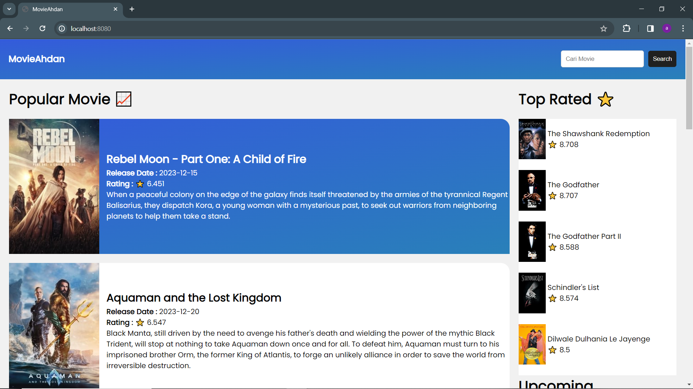

# MovieAhdan

Submission: Membuat Aplikasi Web dengan ES6, Custom Element, NPM, Module Bundler, dan AJAX.

**MovieAhdan** - Aplikasi kumpulan film untuk lulus dari kelas [Belajar Fundamental Front-End Web Development](https://www.dicoding.com/academies/163).

## Tampilan Website



## Kriteria utama MovieAhdan

1. Menggunakan standar _EcmaScript6_ dalam menuliskan kode JavaScript.
2. Terdapat minimal satu penerapan _custom element_.
3. Menggunakan Webpack sebagai module bundler (tahap production).
4. Memanfaatkan Webpack sebagai environment dalam pengembangan proyek (tahap development).
5. Memanfaatkan API dengan menggunakan konsep AJAX dalam menampilkan data yang dinamis pada aplikasi yang dibuat.

Public API yang dimanfaatkan dalam pengerjaan submission: [The Movie Database](https://developer.themoviedb.org/docs)

## Scripts Menjalankan Aplikasi

1. Jalankan untuk menginstal semua dependensi.
   
  ```bash
  npm install
  ```

2. Jalankan untuk membangun aplikasi dalam mode pengembangan menggunakan Webpack.

  ```bash
  npm run dev
  ```

3. Jalankan untuk membangun aplikasi dalam mode produksi menggunakan Webpack.

  ```bash
  npm run build
  ```

4. Jalankan server lokal dengan perintah ini atau menggunakan server lainnya.

  ```bash
  http-server ./dist
  ```

5. Buka aplikasi web di browser dengan mengakses URL yang sesuai.
